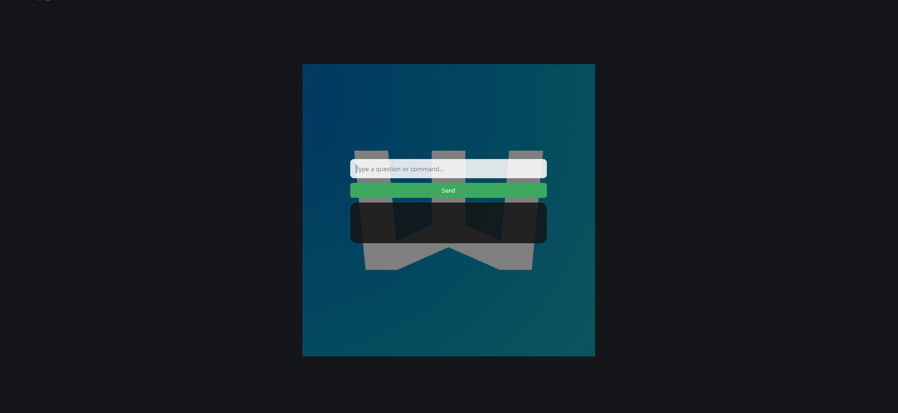

# 🌙 Whispr — Minimal AI Chat, Right from Your Tray

Whispr is a sleek, ultra-lightweight AI assistant that lives silently in your system tray — ready to launch with a simple hotkey. Talk to ChatGPT, open apps, run quick searches, and more — without ever opening a browser.

 <!-- optional image -->

---

## ✨ Features

- ⚡ **Instant hotkey access**: Just press `Ctrl+Shift+Space` (configurable)
- 🧠 **Powered by ChatGPT** (via OpenRouter)
- 🔎 **Smart web commands** like `/g`, `/yt`, `/wiki`, `/img`
- 📂 **Open folders** or apps with `/open` and `/openfolder`
- 💡 **Automatic clipboard copy** of AI responses
- 🕶️ Minimal UI with a stylish blurred overlay

---

## 🛠️ How to Install & Run

1. **Clone or Download** this repo.
2. **Set your OpenRouter API key** in `config.json`:
   ```json
   {
     "api_key": "sk-or-xxxxxxxxxxxxxxxxxxx"
   }
   ```
3. **(Optional)** Customize your:
   - Hotkey
   - App/folder shortcuts
   - Search commands

---

## 🚀 Build to EXE

Make sure Python is installed and PyInstaller is working.

```bash
py -m pip install pyinstaller
py -m PyInstaller --onefile --noconsole --icon=icon.ico --add-data "icon.png;." main.py
```

Your `.exe` will appear in the `/dist` folder.

---

## 🔥 Example Commands

- `What's the capital of Norway?` → 💬 AI responds
- `/g productivity hacks` → Opens Google search
- `/yt lofi chill mix` → Opens YouTube
- `/open notepad` → Launches Notepad
- `/openfolder programfiles` → Opens `C:\Program Files`

---

## 🧩 Config Overview (`config.json`)

```json
{
  "hotkey": "ctrl+shift+space",
  "search_commands": {
    "/g": "https://www.google.com/search?q=",
    "/yt": "https://www.youtube.com/results?search_query="
  },
  "open_apps": {
    "notepad": "C:\\Windows\\System32\\notepad.exe"
  },
  "open_folders": {
    "programfiles": "C:\\Program Files"
  }
}
```

---

## 💡 Inspiration

Whispr was built to feel *invisible* until you need it — like a whisper from your desktop, powered by AI.

---

## 🧊 License

MIT — free for personal or commercial use. Attribution appreciated.

---

> Made with 🖤 by csm